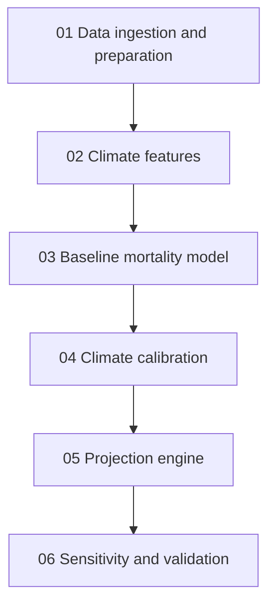
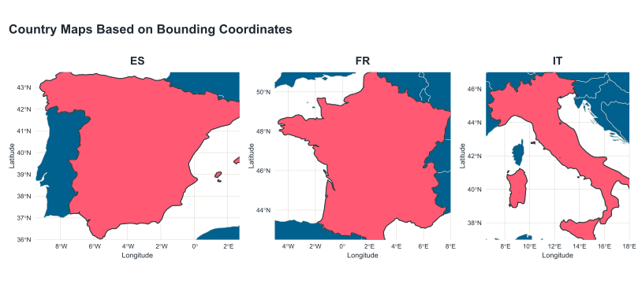

# CC230 Toolkit

**Climate-adjusted mortality and morbidity modeling resources for actuaries**


The **CC230 Toolkit** is a reproducible notebook suite for assessing climate-related impacts on mortality. It is designed for actuaries, actuarial students, researchers, and risk professionals who want to understand how climate hazard variables can be incorporated into a Lee-Carter-style mortality framework.

The toolkit is built around a case study featured in SOA Research Institute report `Quantifying Mortality and Morbidity Impacts from Climate Risk: A Practical Framwork`. The current implementation demonstrates a full analytical workflow: data ingestion, construction of a composite climate index, baseline mortality calibration, climate sensitivity calibration, forward projection, and sensitivity and validation testing, for the reduced-form of the Climate Adjusted Lee-Carter Mortality Model, applicable to three European countries.

> **Important:** This repository is provided for research, education, and illustrative actuarial modeling. It is not a production model and should not be used for pricing, reserving, capital modeling, regulatory reporting, or financial decision-making without independent validation, documentation, governance, and adaptation to the user’s own portfolio and jurisdiction.

---

## Table of contents

- [Who this is for](#who-this-is-for)
- [What the toolkit does](#what-the-toolkit-does)
- [Actuarial modeling framework](#actuarial-modeling-framework)
- [Repository structure](#repository-structure)
- [End-to-end workflow](#end-to-end-workflow)
- [Prerequisites](#prerequisites)
- [Quick start](#quick-start)
- [Input data requirements](#input-data-requirements)
- [Step-by-step guide](#step-by-step-guide)
- [Outputs](#outputs)
- [Model governance checklist](#model-governance-checklist)
- [Troubleshooting](#troubleshooting)
- [Limitations](#limitations)
- [License](#license)
- [Suggested citation](#suggested-citation)

---

## Who this is for

This toolkit is intended for actuarial users who are comfortable with mortality modeling concepts and want a structured bridge from traditional demographic projection methods to climate-risk-adjusted projections.

It is especially relevant for:

- Life, health, pension, and social insurance actuaries
- Actuaries working on climate scenario analysis, ORSA work, stress testing, or long-term liability valuation
- Researchers exploring how physical climate hazards may affect mortality assumptions
- Educators teaching climate risk, longevity risk, or reproducible actuarial analytics

You do not need to be a climate scientist to follow the workflow, but you should be comfortable reviewing modeling assumptions, validating data transformations, and interpreting model outputs in an actuarial context.

---

## What the toolkit does

The repository provides a notebook-based modeling workflow that:

1. Loads mortality and climate data for selected countries
2. Constructs annual country-level climate hazard measures
3. Builds a composite climate index, denoted $C_{t,r}$, where $t$ is year and $r$ is region or country
4. Estimates a baseline Lee-Carter mortality structure
5. Calibrates a climate sensitivity parameter, $\lambda_{x,r}$, by age and country
6. Projects baseline and climate-adjusted mortality rates to a future horizon
7. Produces sensitivity tests and validation diagnostics
8. Saves CSV outputs, diagnostic figures, and HTML reports for review

The current case-study workflow uses Spain, France, and Italy, historical calibration years 2004-2025 excluding 2020 and 2021, and a 2030-2060 projection horizon under an SSP5-8.5 climate pathway. Those values should be treated as case-study settings rather than universal assumptions.

---

## Actuarial modeling framework

The core model extends a Lee-Carter-style mortality structure by adding a climate term:

$\log m_{x,t,r} = a_{x,r} + b_x k_t + \lambda_{x,r} C_{t,r} + \epsilon_{x,t,r}$

Where:

| Term | Actuarial interpretation |
| --- | --- |
| $m_{x,t,r}$ | Central mortality rate at age $x$, year $t$, and country or region $r$. |
| $a_{x,r}$ | Country-specific age profile of log mortality. |
| $b_x$ | Age sensitivity to the common mortality time index. |
| $k_t$ | Period mortality index, estimated historically and projected forward. |
| $C_{t,r}$ | Composite climate hazard index for year $t$ and country or region $r$ (this is an exogenous climate variable) |
| $\lambda_{x,r}$ | Climate sensitivity of log mortality by age and country or region (this is the endogenous response fuction, calibrated and dependent on the model specification) |
| $\epsilon_{x,t,r}$ | Residual component not explained by the baseline and climate terms. |

The toolkit first estimates the non-climate Lee-Carter component, then uses residuals from that baseline structure to calibrate the climate adjustment.

---

## Repository structure

```text
CC230-Toolkit/
├── config/
│   ├── scenarios.yaml               # Scenario definitions and data-source mapping
│   ├── settings.yaml                # Project, run, scope, mortality, climate, and reporting settings
│   └── soa-logo.png
├── data/
│   ├── raw/                         # User-provided raw climate and mortality data
│   ├── interim/                     # Run configuration and manifests created by the notebooks
│   └── processed/                   # Cleaned mortality and climate features
├── docs/                            # Documentation placeholder
├── notebooks/
│   ├── 00_notebook_driver.ipynb     # Optional sequential notebook runner
│   ├── 01_data_ingestion_and_preparation.ipynb
│   ├── 02_climate_features.ipynb
│   ├── 03_baseline_mortality_model.ipynb
│   ├── 04_climate_calibration.ipynb
│   ├── 05_projection_engine.ipynb
│   ├── 06_sensitivity_and_validation.ipynb
│   ├── executed_notebooks/          # Executed notebook copies
│   └── notebook_list.txt
├── outputs/                         # Model parameters, projections, diagnostics, and figures
├── reports/                         # HTML renderings of the notebooks
├── src/
│   └── country_boxes.R              # Optional R map helper for Spain, France, and Italy
├── LICENSE
└── README.md
```

---

## End-to-end workflow

The notebooks are designed to be run in sequence.



Each notebook writes outputs and a manifest that downstream notebooks read. This design reduces manual file-name reconstruction and supports reproducibility.

| Step | Notebook | Main purpose | Review gate |
| --- | --- | --- | --- |
| 1 | `01_data_ingestion_and_preparation.ipynb` | Load raw mortality and climate data; create cleaned datasets and run configuration. | Confirm raw files, countries, years, age range, and climate scenario |
| 2 | `02_climate_features.ipynb` | Build the composite climate hazard index $C_{t,r}$. | Review standardization, component weights, and climate-index diagnostics |
| 3 | `03_baseline_mortality_model.ipynb` | Estimate baseline Lee-Carter parameters $a_{x,r}$, $b_x$, and $k_t$. | Review explained variance, fitted values, and residuals |
| 4 | `04_climate_calibration.ipynb` | Estimate climate sensitivity $\lambda_{x,r}$ from baseline residuals and historical $C_{t,r}$. | Review lambda estimates and calibration diagnostics |
| 5 | `05_projection_engine.ipynb` | Project baseline and climate-adjusted mortality rates. | Review projected $k_t$, climate component, and relative mortality impacts |
| 6 | `06_sensitivity_and_validation.ipynb` | Run sensitivity tests and validation checks. | Review reasonableness flags, goodness-of-fit metrics, and scenario sensitivity |

---

## Prerequisites

### Software

Use one of the following notebook environments:

- JupyterLab
- Jupyter Notebook
- VS Code with the Jupyter extension
- Anaconda Navigator
- Google Colab
- Kaggle Notebooks

The notebook reports state that the notebooks were developed using Python 3.14.5. For institutional use, create a controlled virtual environment and pin package versions before relying on results.

### Suggested Python environment

The repository includes a locked `requirements.txt` file. A practical starter environment is:

```bash
python -m venv .venv

# macOS / Linux
source .venv/bin/activate

# Windows PowerShell
# .venv\Scripts\Activate.ps1

python -m pip install --upgrade pip
python -m pip install \
  jupyter \
  nbconvert \
  nbformat \
  pandas \
  numpy \
  scipy \
  matplotlib \
  xarray \
  netCDF4 \
  h5netcdf \
  pyyaml \
  statsmodels
```

Depending on the climate data format and execution platform, you may need additional packages such as `cftime`, `dask`, or geospatial libraries.

### Optional R environment

The `src/country_boxes.R` script creates country map visuals. It uses:

```r
install.packages(c("sf", "ggplot2", "rnaturalearth", "rnaturalearthdata", "patchwork"))
```

This R script is optional and is not required for the core Python notebook workflow.

---

## Quick start

Clone the repository:

```bash
git clone https://github.com/Arocha-Associates/CC230-Toolkit.git
cd CC230-Toolkit
```

Create and activate a Python environment, then install the required packages as shown above.

Place raw mortality and climate files in the expected `data/raw/` subfolders. See [Input data requirements](#input-data-requirements).

Run the notebooks in order from the `notebooks/` folder:

```bash
cd notebooks
jupyter lab
```

Open `01_data_ingestion_and_preparation.ipynb`, review the case-study parameters, and execute the notebook. Continue through Notebooks 2 to 6.

Alternatively, use the driver notebook from inside the `notebooks/` folder:

```bash
cd notebooks
jupyter nbconvert \
  --to notebook \
  --execute 00_notebook_driver.ipynb \
  --output 00_notebook_driver_executed.ipynb \
  --output-dir executed_notebooks \
  --ExecutePreprocessor.timeout=-1
```

The driver notebook contains settings that allow you to pause between notebooks for review or run the sequence automatically.

---

## Input data requirements

Notebook 01 expects raw demographic and climate files in the repository’s `data/raw/` directory. The exact file names depend on the selected scenario and case-study settings.

### Mortality inputs

Expected location:

```text
data/raw/demographic/
```

Typical file pattern:

```text
mortality_mx_{COUNTRY}.csv
```

The processed mortality dataset should include, at minimum, country, year, age, and central mortality rate fields.

### Climate inputs

Expected location:

```text
data/raw/climate/
```

Typical files include:

```text
era5_monthly_t2m.nc
era5_daily_tmax_*.nc
cmip6_monthly_tas_{SCENARIO}_2030_2060.nc
cmip6_daily_tasmax_{SCENARIO}_2030_2060.nc
```

The workflow currently uses historical ERA5-style data for calibration and CMIP6-style projection data for the selected scenario.

### Scenario configuration

Scenario definitions are stored in:

```text
config/scenarios.yaml
```

The file includes reference, SSP, and NGFS-style scenario families, with climate hazards such as temperature anomaly, extreme heat days, and PM2.5. Confirm file paths, scenario names, and source documentation before execution.

### Run configuration

Core run settings are stored in:

```text
config/settings.yaml
```

Notebook 01 also writes a downstream configuration file:

```text
data/interim/run_config.json
```

Downstream notebooks read `run_config.json` to preserve consistency across scenario, countries, calibration years, projection years, age range, and file labels.

### Country specification

Countries are approximated using latitude-longitude bounding boxes rather than national mainland boundaries. The current country definitions are:

```
COUNTRY_BOXES = {
    "ES": {"lat_min": 36.0, "lat_max": 43.7, "lon_min": - 9.5, "lon_max":  2.7},
    "FR": {"lat_min": 42.5, "lat_max": 51.0, "lon_min":  -5.0, "lon_max":  8.0},
    "IT": {"lat_min": 37.0, "lat_max": 47.0, "lon_min":   6.5, "lon_max": 18.0},    
}
```


A more refined implementation could use geographic polygons instead of rectangular bounding boxes.

---

## Step-by-step guide

### Step 1 — Data ingestion and preparation

Notebook:

```text
notebooks/01_data_ingestion_and_preparation.ipynb
```

Purpose:

- Load raw mortality files
- Load historical and projected climate files
- Select countries, calibration years, projection years, and age range
- Exclude selected anomalous years where appropriate
- Create cross-notebook configuration and manifests
- Save cleaned demographic and climate layers

Key outputs include:

```text
data/interim/run_config.json
data/interim/input_manifest.csv
data/interim/01_data_ingestion_and_preparation_output_manifest.csv
data/processed/demographic/country_age_year_*.csv
data/processed/climate/temperature_anomaly_country_annual_*.csv
data/processed/climate/heat_metrics_country_annual_*.csv
data/processed/climate/heat_thresholds_country_era5_*.csv
```

Actuarial review points:

- Are the country and age selections appropriate for the liability portfolio?
- Are excluded years justified and documented?
- Are mortality rates central rates, initial rates, or another measure?
- Are missing data interpolations or exclusions acceptable?
- Do climate files have appropriate spatial and temporal resolution?

---

### Step 2 — Climate feature construction

Notebook:

```text
notebooks/02_climate_features.ipynb
```

Purpose:

- Read climate layers created by Notebook 01
- Standardize climate components by country using the historical calibration period
- Construct the composite climate index $C_{t,r}$
- Save historical and projected climate-index outputs

The composite index is constructed from standardized components:

$C_{t,r}=w_1 Z(\text{TempAnomaly}_{t,r}) + w_2 Z(\text{ExtremeHeatDays}_{t,r}) + w_3 Z(\text{HeatWaveDuration}_{t,r})$

Key outputs include:

```text
data/processed/climate/C_tr_core_country_annual_combined_*.csv
data/processed/climate/C_tr_core_country_annual_era5_*.csv
data/processed/climate/C_tr_core_country_annual_cmip6_*.csv
data/processed/climate/C_tr_standardization_parameters_*.csv
data/processed/climate/C_tr_weights.csv
```

Actuarial review points:

- Are climate weights judgment-based, empirically supported, or scenario-specific?
- Is the standardization period appropriate?
- Are projected values standardized using historical parameters without re-centering?
- Should additional hazards be added for the use case, such as air pollution, wildfire smoke, humidity, flood, or vector-borne disease proxies?

---

### Step 3 — Baseline mortality model

Notebook:

```text
notebooks/03_baseline_mortality_model.ipynb
```

Purpose:

- Estimate the baseline non-climate mortality model.
- Fit $a_{x,r}$, $b_x$, and $k_t$.
- Produce fitted values and residuals for climate calibration.

The baseline model is:

$\log m^{\text{base}}_{x,t,r} = a_{x,r} + b_x k_t$

Key outputs include:

```text
outputs/baseline_parameters_a_xr_*.csv
outputs/baseline_parameters_b_x_*.csv
outputs/baseline_parameters_k_t_*.csv
outputs/baseline_fitted_mortality_*.csv
outputs/baseline_residuals_*.csv
outputs/baseline_residual_diagnostics_*.csv
```

Actuarial review points:

- Does the first Lee-Carter component explain a sufficient share of variation?
- Are fitted mortality curves smooth and plausible by age and country?
- Are residuals centered and free of obvious structure?
- Is the selected historical period long enough for robust calibration?
- Should country-specific $b_x$ or multi-factor extensions be tested?

---

### Step 4 — Climate calibration

Notebook:

```text
notebooks/04_climate_calibration.ipynb
```

Purpose:

- Join baseline residuals from Notebook 03 with historical $C_{t,r}$ from Notebook 02.
- Estimate $\lambda_{x,r}$ by age and country.
- Compute climate-adjusted fitted mortality values.
- Produce calibration diagnostics.

The calibration links the baseline residual to the climate index:

$\epsilon_{x,t,r}^{\text{base}} \approx \lambda_{x,r} C_{t,r}$

Key outputs include:

```text
outputs/climate_parameters_lambda_xr_*.csv
outputs/climate_calibration_panel_*.csv
outputs/climate_calibration_diagnostics_*.csv
outputs/climate_calibration_summary_*.csv
outputs/climate_adjusted_fitted_mortality_*.csv
```

Actuarial review points:

- Are $\lambda_{x,r}$ estimates stable by age and country?
- Are estimates consistent with clinical, demographic, and climate-risk expectations?
- Does adding the climate term improve residual diagnostics?
- Are negative climate sensitivities explainable, or should they be constrained?
- Is a no-intercept regression appropriate for the intended interpretation?

---

### Step 5 — Projection engine

Notebook:

```text
notebooks/05_projection_engine.ipynb
```

Purpose:

- Project $k_t$ forward.
- Combine projected $k_t$, calibrated $\lambda_{x,r}$, and projected $C_{t,r}$.
- Produce baseline and climate-adjusted mortality projections.
- Summarize relative and absolute climate impacts.

The projected climate-adjusted model is:

$\log m_{x,t,r}^{\text{climate-adjusted}} = a_{x,r} + b_x k_t^{\text{proj}} + \lambda_{x,r} C_{t,r}^{\text{proj}}$

The no-climate comparison projection is:

$\log m_{x,t,r}^{\text{baseline}} = a_{x,r} + b_x k_t^{\text{proj}}$

Key outputs include:

```text
outputs/projected_k_t_*.csv
outputs/projected_mortality_baseline_and_climate_adjusted_*.csv
outputs/projected_mortality_impact_summary_*.csv
outputs/projected_mortality_by_country_year_*.csv
```

Actuarial review points:

- Is the $k_t$ projection method appropriate for the product, population, and horizon?
- Is the climate scenario a central assumption, adverse scenario, or stress scenario?
- Are projected relative impacts plausible by country, age band, and year?
- Are mortality impacts directionally consistent with the physical-risk narrative?
- Are long-term extrapolations communicated with appropriate uncertainty?

---

### Step 6 — Sensitivity and validation

Notebook:

```text
notebooks/06_sensitivity_and_validation.ipynb
```

Purpose:

- Test sensitivity to alternative climate-index weights.
- Test component exclusions from $C_{t,r}$.
- Apply selected shocks to $\lambda_{x,r}$.
- Produce residual diagnostics, reasonableness flags, and goodness-of-fit measures.

Sensitivity families include:

- Alternative climate-index weights.
- Exclusion of temperature anomaly, extreme heat days, or heatwave duration.
- Lambda shocks such as 50%, 100%, 150%, and 200% of calibrated sensitivity.

Key outputs include:

```text
outputs/sensitivity_projection_panel_*.csv
outputs/sensitivity_summary_by_experiment_*.csv
outputs/sensitivity_summary_country_year_*.csv
outputs/sensitivity_summary_country_age_*.csv
outputs/validation_reasonableness_flags_*.csv
outputs/validation_reasonableness_flag_summary_*.csv
outputs/residual_validation_diagnostics_*.csv
outputs/residual_gof_*.csv
outputs/climate_index_experiment_gof_*.csv
```

Actuarial review points:

- Which assumptions drive projected mortality impacts most strongly?
- Are validation flags concentrated in specific ages, countries, or years?
- Does the climate component improve historical fit without overfitting?
- Are sensitivity results suitable for board, regulator, or management reporting?
- Which assumptions require expert judgment sign-off?

---

## Outputs

The `outputs/` directory contains model-ready CSV files and diagnostic figures. The main categories are:

| Category | Examples | Use |
| --- | --- | --- |
| Baseline mortality parameters | `baseline_parameters_a_xr_*`, `baseline_parameters_b_x_*`, `baseline_parameters_k_t_*` | Review and reuse baseline Lee-Carter components. |
| Baseline fitted values and residuals | `baseline_fitted_mortality_*`, `baseline_residuals_*` | Validate non-climate model fit and feed climate calibration. |
| Climate calibration | `climate_parameters_lambda_xr_*`, `climate_calibration_summary_*` | Review age-country climate sensitivities. |
| Projections | `projected_mortality_baseline_and_climate_adjusted_*` | Compare baseline and climate-adjusted mortality. |
| Impact summaries | `projected_mortality_impact_summary_*`, `projected_mortality_by_country_year_*` | Summarize impacts by country, year, and age. |
| Sensitivity outputs | `sensitivity_summary_*`, `component_exclusion_*`, `sensitivity_*` | Assess assumption sensitivity. |
| Validation diagnostics | `validation_reasonableness_*`, `residual_gof_*` | Support model governance and reasonableness review. |
| Figures | `.svg` files | Use in reports and presentations after review. |

The `reports/` directory contains HTML versions of the notebooks. These are useful for audit review because they preserve narrative, outputs, tables, and diagnostics in a readable format.

---

## Model governance checklist

Before using the toolkit for any business or regulatory purpose, complete a formal model governance review.

### Data controls

- Confirm mortality data source, definition, coverage, and quality.
- Confirm climate data source, version, scenario, spatial resolution, and temporal resolution.
- Document treatment of missing values, excluded years, outliers, and transformations.
- Verify that all raw data licenses permit the intended use.

### Methodology controls

- Document why the selected countries, age range, calibration period, and projection horizon are appropriate.
- Review whether a single $b_x$ across countries is appropriate for the use case.
- Validate the climate-index construction and component weights.
- Review the treatment of negative $\lambda_{x,r}$ estimates.
- Test alternative $k_t$ projection approaches.
- Assess parameter uncertainty and scenario uncertainty.

### Output controls

- Reconcile row counts across country, age, year, and scenario dimensions.
- Reproduce key outputs from a clean environment.
- Review reasonableness flags and document resolutions.
- Compare outputs against independent benchmarks or expert expectations.
- Archive input manifests, output manifests, executed notebooks, and HTML reports.

### Communication controls

- Clearly distinguish baseline, climate-adjusted, and sensitivity outputs.
- Avoid presenting scenario results as forecasts.
- Explain that climate scenarios represent conditional pathways, not probabilities.
- State all model limitations and material judgments.

---

## Troubleshooting

### `FileNotFoundError` for raw data

Confirm that files are placed under `data/raw/demographic/` and `data/raw/climate/` using the file names expected by Notebook 01. The notebooks rely on consistent naming conventions and scenario labels.

### Downstream notebooks cannot find inputs

Run Notebook 01 first, then proceed sequentially. Downstream notebooks read `data/interim/run_config.json` and manifest files created by prior notebooks.

### Driver notebook cannot find notebooks

Run the driver from inside the `notebooks/` folder. The driver expects the working directory to be the notebook directory.

### `nbconvert` validation warning or schema error

If a notebook execution fails because of notebook metadata schema validation, open the affected notebook in JupyterLab or VS Code, save it, and rerun. Also consider upgrading `nbformat`, `nbconvert`, and `jupyter` in the active environment.

```bash
python -m pip install --upgrade nbformat nbconvert jupyter
```

### NetCDF files do not open

Install or upgrade NetCDF backends:

```bash
python -m pip install --upgrade xarray netCDF4 h5netcdf cftime
```

### Results differ across machines

Use a pinned environment and archive the executed notebooks. For formal work, create a `requirements.txt` or `environment.yml` file and run from a clean environment.

---

## Limitations

This toolkit is intentionally transparent and educational. Key limitations include:

- The case study is not calibrated to a specific insurer, pension plan, or national population exposure base
- Climate-mortality relationships are represented through a simplified reduced-form model
- The selected climate index is judgment-based and should be stress-tested
- Historical calibration may not capture future adaptation, medical progress, migration, technology, or behavioral change
- Climate scenarios are conditional pathways and should not be interpreted as probability-weighted forecasts
- The notebook workflow is not a production data pipeline
- Results require independent actuarial, statistical, epidemiological, and climate-risk review before operational use

---

## Roadmap ideas

Potential enhancements include:

- Add automated tests for row counts, required columns, and manifest consistency
- Add example synthetic data for users who do not have licensed raw climate or mortality datasets.
- Add portfolio-weighted aggregation for insurer or pension-plan liability analysis.
- Add confidence intervals or bootstrap-based parameter uncertainty.
- Add scenario comparison dashboards across SSP and NGFS pathways.
- Add documentation for adapting the workflow to morbidity incidence, claim costs, or prevalence rates.

---

## Contributing

Contributions are welcome if they improve reproducibility, actuarial clarity, documentation, or validation.

Recommended contribution types:

- Documentation improvements
- Additional validation checks
- Environment and dependency files
- Synthetic sample datasets
- New scenario adapters
- Additional actuarial model variants

Before submitting changes, run the full notebook sequence and confirm that generated reports and manifests are internally consistent.

---

## License

The repository includes an MIT License. Individual notebooks and reports may also contain separate notices for textual content and source code. Review the license file and in-notebook notices before reusing or redistributing materials.

---

## Suggested citation

Arocha, C. and Crugnola-Humbert, J. (2026). **CC230 Toolkit: Modeling resources supporting the assessment of climate-related impacts on mortality and morbidity.** Arocha-Associates GitHub repository.

---

## Professional-use reminder

For actuarial applications, treat this toolkit as a transparent starting point. Before using any result in a professional opinion, valuation, pricing exercise, capital model, or disclosure process, apply your organization’s model risk management framework and the actuarial standards of practice applicable in your jurisdiction.
